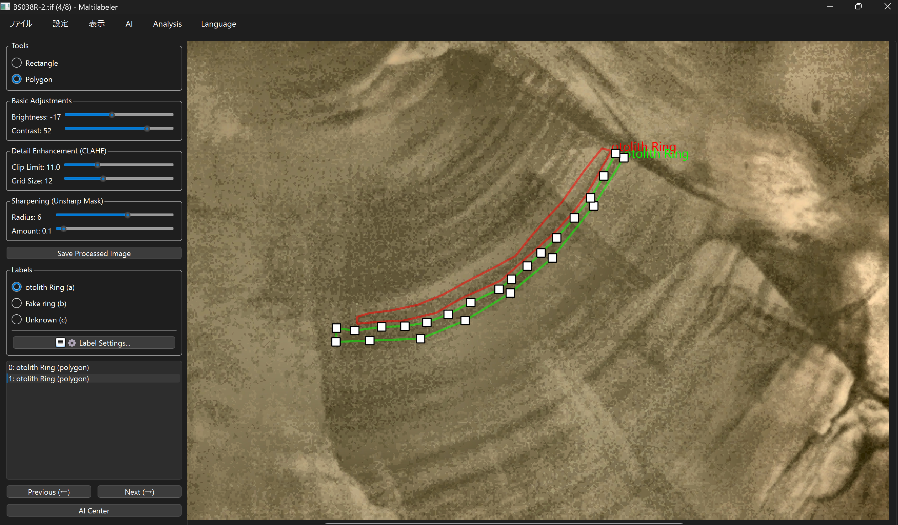

# Maltilabeler: Human–AI Collaborative Annotation Toolkit

[](./)  
[](./)  
[](./)  
[](./)

---

## 1. Project Purpose: Human–AI Collaboration in Scientific Research



Maltilabeler is a desktop annotation toolkit designed for **scientific imaging workflows**, where domain experts and AI models must collaborate rather than compete.

The core concept is:

> **“Human–AI co-creation of high‑quality labels for research data.”**

Instead of hiding the model behind a black box, Maltilabeler focuses on:

- **What it enables**: high‑quality, traceable annotations and model training data for scientific studies.
- **Why it is designed this way**: to support reproducible research, safe iteration on models, and efficient expert workflows.

Key principles:

- **Production-hardened**: robust error handling, logging, validation, and thread safety.
- **Extensible**: plugin architecture, AI-center, interactive segmentation tools.
- **Research-friendly**: well-defined CSV/YOLO-style exports and retraining loops.
- **User-centric**: a GUI designed to minimize cognitive load for domain experts.
- **Internationalized**: Qt `tr()` support and runtime language switching.

> **Note on confidentiality**  
> For publication, some module and file names that contain domain- or research-specific terms are intentionally **generalized** (e.g., `domain_measurement_plugin.py` instead of the actual internal name). The design and architecture remain accurately represented.

---

## 2. Repository Structure

High-level structure (tree-style).  
This intentionally emphasizes **UI vs logic separation**, **plugins**, and **test/sample assets**.

```text
maltilabeler/
├─ app.py                           # Application entrypoint & lifecycle manager
├─ config.json                      # User/configuration (labels, language, etc.)
├─ annotations.csv                  # Project-level annotations export (example)
├─ maltilabeler.spec                # PyInstaller one-file build spec
├─ logic/                           # Core logic (no UI code)
│  ├─ project_manager.py            # Project I/O, image list, annotation cache, CSV save
│  ├─ drawing_item.py               # QGraphicsItem-based annotation layer
│  ├─ image_processing.py           # CV/image utilities (OpenCV + NumPy)
│  ├─ config_manager.py             # JSON-based configuration & language settings
│  ├─ zoomable_view.py              # Zoomable/pannable QGraphicsView for large images
│  ├─ training_manager.py           # Worker to build YOLO-style dataset & launch training
│  ├─ analysis_manager.py           # Worker to run model inference & collect OBB results
│  ├─ sam_manager.py                # Segment Anything model lifecycle (lazy, device-aware)
│  ├─ plugin_interface.py           # Base interfaces for Maltilabeler plugins
│  ├─ plugin_manager.py             # Discovery/registration & plugin notification hooks
│  └─ tools/                        # Canvas tools (annotation actions)
│     ├─ base_tool.py               # Abstract base for all tools
│     ├─ selection_tool.py          # Selection & editing of existing annotations
│     ├─ obb_tool.py                # Oriented box creation/editing
│     ├─ polygon_tool.py            # Polygon/line annotation creation
│     └─ sam_tool.py                # Prompt-based SAM interactive segmentation tool
├─ ui/                              # Presentation layer (PyQt6 widgets)
│  ├─ main_window.py                # Primary annotation window (canvas + side panels)
│  ├─ launcher.py                   # Project launcher (create new / open existing)
│  ├─ ai_center_window.py           # “AI Operation Center” (train/infer tabs)
│  ├─ image_adjustment_panel.py     # Brightness/contrast/CLAHE/sharpening controls
│  ├─ unsharp_mask_dialog.py        # UI for sharpening settings
│  ├─ binarization_dialog.py        # UI for binarization settings
│  ├─ clahe_dialog.py               # UI for CLAHE settings
│  ├─ edge_detection_dialog.py      # UI for edge-detection settings
│  ├─ label_editor_dialog.py        # UI for editing label set & shortcuts
│  ├─ new_project_dialog.py         # UI for creating projects from raw image folders
│  └─ review_window.py              # Independent review window for AI predictions
├─ plugins/                         # Extensible plugins for advanced analysis workflows
│  ├─ feasibility_analyzer_plugin.py
│  │                                # Dataset feasibility analysis (t-SNE, learning curve)
│  ├─ domain_measurement_plugin.py  # Domain-specific measurement workflow (generalized name)
│  └─ example_plugin.py             # Simple example / “Hello world” plugin
├─ models/                          # Model checkpoints (e.g., SAM, trained YOLO) – data only
├─ translations/                    # Qt .qm translation assets
│  ├─ en_US.qm
│  └─ ja_JP.qm
├─ output/                          # Generated artifacts (CSV exports, plots, retraining data)
│  ├─ annotations.csv               # Example project annotations
│  ├─ retraining_data.csv           # Human-corrected labels for retraining cycles
│  └─ plots/                        # t-SNE and learning curve figures
├─ sample_projects/                 # Example/test projects used for integration runs
│  ├─ sample_project_01/
│  └─ sample_project_02/
└─ tools/                           # Small scripts (e.g., LOC counters) – optional
   └─ count_loc.py
```

> **Note**:  
> Directory and file names here are slightly normalized and anonymized for publication; internally, the structure follows the same composition and responsibilities.

---

## 3. Main Features (Engineering Perspective)

*(This section is mostly unchanged, but wording is aligned with the constraints: it focuses on **what** and **why**, not on internal numeric parameters or formulas.)*

### 3.1 Application Lifecycle & Robustness

- Central `ApplicationManager` (in [app.py]) owns:
  - `QApplication`, translators, main window, and project manager.
  - The full startup sequence: launcher → project manager → main window → first image load.
- Hardened behavior:
  - Comprehensive `try/except` boundaries around each major step.
  - Logging of failures with stack traces, while showing user-friendly dialogs.
  - Consistent cleanup for window, project manager, and translators on exit.

### 3.2 Project Management & Traceability

- `ProjectManager` manages:
  - Project folder structure and validation.
  - Image enumeration and current index.
  - Per-image annotation cache and per-image adjustment parameters.
- Data integrity features:
  - Strict validation of project paths, image files, and annotation payloads.
  - Guardrails on maximum counts for images and annotations to keep projects manageable.
  - CSV export implemented with **backups** and error-aware restore logic.
- Traceability:
  - A **canonical CSV** for project-level annotations.
  - A separate **retraining CSV** that stores human-corrected predictions from the review window.
  - Clear separation between raw images, project images, and model output artifacts.

### 3.3 Annotation & Interaction Layer

- `DrawingItem` abstracts all on-canvas annotation logic:
  - Maintains an in-memory list of annotations with a stable, dictionary-based schema.
  - Performs coordinate and structural validation to avoid invalid shapes.
  - Emits selection changes back to the UI without directly knowing about widgets.
- Tool system ([logic/tools/]):
  - `BaseTool` defines a minimal, event-driven interface.
  - Tools handle mouse events and painting; the canvas orchestrates which tool is active.
  - Tools are replaceable and extendable without impacting the main UI.

### 3.4 Main Window & User Flow

- `MainWindow` composes:
  - Left-hand panel with tools, image adjustment, label radios, navigation, and AI entry points.
  - Center canvas with `ZoomableView` + `DrawingItem`.
  - Optional AI-related windows (AI center, plugins, review windows).
- Config-driven labels:
  - Label definitions and shortcuts are loaded from JSON.
  - UI widgets and keyboard shortcuts are rebuilt dynamically when config changes.
  - All of this is wired through safe helper methods, avoiding stale references.

### 3.5 Image Processing Utilities

- [image_processing.py] exposes **pure functions** that take `QPixmap` and return new `QPixmap` objects.
- Functions are responsible for:
  - Format-safe conversions between Qt and NumPy/OpenCV.
  - Building multi-step pipelines (e.g., brightness/contrast + histogram equalization + sharpening) in a controlled, testable way.
- Design emphasizes:
  - Clear boundaries between **parameter selection in the UI** and **actual image manipulation in logic**.
  - Lazy imports for heavy libraries to keep startup performance acceptable.

### 3.6 AI Center: Training & Inference Flows

- [AICenterWindow]:
  - **Training Mode**: uses [TrainingWorker] to prepare a YOLO-style dataset and launch a CLI training run.
  - **Analysis Mode**: uses [AnalysisWorker] to run a trained model on a target image and emit oriented bounding boxes.
- Workers are run on `QThread` instances:
  - UI stays responsive.
  - Logs are streamed line-by-line to the UI.
  - Completion and error states are signaled back via Qt signals.

### 3.7 SAM Integration (Segment Anything)

- [SAMManager]:
  - Handles checkpoint download, model loading, and device selection.
  - Uses lazy imports and device checks to decide whether GPU acceleration is available.
  - Falls back cleanly to CPU if necessary, so the feature remains usable in CPU-only environments.
- [SAMTool]:
  - Collects point prompts on the canvas and visualizes preview masks.
  - Converts masks into regular polygon annotations once the user confirms, making SAM a **tool inside a larger annotation workflow**, not a black box.

### 3.8 Plugin Architecture & Advanced Analysis

- [plugin_interface.py] and [plugin_manager.py]:
  - Base interfaces for plugins and runtime discovery/registration.
  - Provide hooks such as:
    - Adding menu items.
    - Receiving notifications when images are loaded or annotations change.
- Example plugins:
  - `feasibility_analyzer_plugin.py`:
    - Performs dataset-level feasibility analysis (feature extraction, dimensionality reduction, learning-curve style evaluation).
    - Offloads heavy computation to a background worker and generates plots for inspection.
  - `domain_measurement_plugin.py` (generalized name):
    - Implements a domain-specific measurement workflow that leverages existing annotations.
    - Guides users through calibration and measurement steps via a modeless dialog.
    - Writes results to CSV so they can be consumed by downstream statistical tools.

---
## 📖 Documentation

For detailed usage instructions, please refer to the **[User Guide](docs/USER_GUIDE.md)**.
It covers the complete workflow from project creation to AI-assisted annotation.

---

## 4. Getting Started

This section focuses on **reproducibility** and **deployment friendliness**, rather than internal algorithms.

### 4.1 Environment Setup with Conda

The recommended way to create a reproducible environment is to use **Anaconda / Miniconda** and **conda-forge**:

```bash
# 1. Create and activate an isolated environment
conda create -n maltilabeler python=3.10
conda activate maltilabeler

# 2. Install core dependencies from conda-forge when possible
conda install -c conda-forge pyqt opencv numpy pandas pillow matplotlib
conda install -c conda-forge pytorch torchvision cpuonly  # or CUDA-enabled build if available

# 3. Install remaining Python packages via pip
pip install ultralytics
pip install scikit-learn
pip install segment-anything-py  # or equivalent SAM wrapper
```

Notes:

- The exact package names and versions can be pinned in an `environment.yml` for fully reproducible installs.
- Heavy packages (PyTorch, Qt, OpenCV) are intentionally **isolated in a dedicated environment**, reducing conflicts with other projects.

### 4.2 Running the Application from Source

```bash
# From the project root
python app.py
```

- The `ApplicationManager` will:
  - Initialize the Qt application with internationalization.
  - Open a launcher dialog where you can create a new project or open an existing one.
- Projects consist of:
  - A directory with an `images/` subfolder.
  - Associated outputs under [output/] (CSV annotations, plots, retraining data).

### 4.3 Building a Standalone Binary with PyInstaller

The project ships with a **PyInstaller spec** ([maltilabeler.spec]) configured for a **one-file** build:

- Data folders such as [plugins/], [translations/], and [models/] are included as bundled data resources.
- PyQt6 and scientific libraries are declared as hidden imports where needed.
- The build can be run on Windows via:

```bash
pyinstaller maltilabeler.spec
```

This produces a single executable suitable for non-technical users (e.g., internal researchers who do not manage Python environments themselves).

### 4.4 GPU vs. CPU Environments

The design explicitly accounts for environments with and without GPUs:

- **Device-agnostic logic**:
  - Components such as [SAMManager] and the AI workers query the underlying libraries to determine whether GPU acceleration is available.
  - If a GPU is not available or dependencies are missing, the system falls back to CPU-friendly behavior where possible.
- **User-friendly defaults**:
  - No manual device configuration is required for end users.
  - Errors related to missing optional dependencies are surfaced as clear, actionable messages (e.g., which package to install), rather than low-level tracebacks.

This makes it possible to:

- Prototype on a laptop without a GPU.
- Move the identical codebase to a GPU-enabled workstation or server when scaling up.

---

## 5. Technology Stack (Recap)

*(Shortened recap; details are in the original Tech Stack section.)*

- **Language & runtime**: Python 3.x
- **GUI**: PyQt6 (QMainWindow, QDialogs, QGraphicsScene/QGraphicsItem, QThreads)
- **Image/Scientific**: OpenCV, NumPy, Pillow
- **ML / DL**: PyTorch, Torchvision, Ultralytics YOLO, Segment Anything
- **Data & Viz**: pandas, scikit-learn, matplotlib, PyYAML
- **Packaging**: PyInstaller (one-file mode)

---

## 6. Role Profile Matching: Why This Matters for AI/ML Roles

This section explicitly connects the design decisions to competencies relevant for **AI/ML engineering roles in pharma and scientific domains**.

### 6.1 MLOps & Data Integrity

- **End-to-end data pipeline from raw images to training-ready datasets**
  - Clear progression:
    - Raw scientific images → project images.
    - Expert annotations → canonical CSV.
    - Canonical CSV → YOLO-style dataset (images, labels, configuration file).
    - Trained model → prediction outputs → retraining CSV.
  - Each step is implemented by a dedicated component (`ProjectManager`, [TrainingWorker], [AnalysisWorker], plugins) to keep responsibilities isolated and testable.

- **Traceable and auditable annotations**
  - Project-level CSV export with a stable schema acts as the **single source of truth** for labels.
  - Separate **retraining CSV** captures human corrections to model predictions in the review window, which:
    - Makes “what the model thought” vs. “what the expert corrected” explicit.
    - Enables targeted retraining and retrospective analysis on how the dataset evolved over time.

- **Defensive programming around data**
  - Strong emphasis on:
    - Input validation for paths, images, and annotation records.
    - Guardrails against inconsistent annotation structures.
    - Backup/restore logic for CSV writes to prevent irreversible corruption.
  - This aligns with regulated domains where **data integrity and recoverability** are mandatory.

- **Operationalization via background workers**
  - Long-running tasks (dataset preparation, model training, analysis, feasibility reports) are executed in background threads with:
    - Real-time log streaming to the GUI.
    - Clear success/failure signaling.
  - This represents a **production-minded approach** to model workflows, rather than ad-hoc scripts.

- **Dataset feasibility analysis plugin**
  - The feasibility analyzer plugin:
    - Uses standard deep-learning backbones and classical ML tooling to gauge dataset separability and learning behavior.
    - Produces visual artifacts (e.g., t-SNE-like plots, learning curve-style plots) stored in [output/].
  - This showcases:
    - Awareness of **data-centric AI** (understanding data quality before over-investing in modeling).
    - Integration of **statistical insight** into the labeling and training loop.

### 6.2 GUI Design & User Centricity

- **Designed for domain experts, not ML engineers**
  - The main window and plugins are organized around the mental model of a researcher:
    - Left-hand panel: tools, labels, navigation, image enhancement.
    - Central area: high-resolution image with context-preserving zoom/pan.
    - Dedicated “AI Center” for training and inference, separated from manual annotation.
  - This separation reduces cognitive load: users always know **where** to perform which type of task.

- **Reducing cognitive overhead for annotation**
  - Config-driven labels and keyboard shortcuts:
    - Experts can shape the label set to match their ontology (e.g., tissue structures, cell types, etc.).
    - Once configured, labels are a single click or single key-press away.
  - Automatic synchronization between:
    - Canvas selection and list selection.
    - Label radios and the currently selected annotation.

- **Human-in-the-loop AI correction workflow**
  - The review window is a separate, focused space for:
    - Visual inspection of AI predictions.
    - Manual correction with the same tooling used in manual annotation.
    - One-button export of corrected annotations into a retraining dataset.
  - This emphasizes **collaboration with AI**:
    - The model proposes.
    - The expert disposes.
    - The system captures this interaction in a structured, reusable form.

- **Interactive segmentation as a tool, not a black box**
  - SAM-based segmentation is integrated via a dedicated tool, not a hidden pipeline:
    - Users provide explicit prompts (positive/negative points).
    - The perceived “AI magic” is visual and incremental.
  - This is particularly important in domains like pharma, where **explainability and user control** matter.

- **Internationalization and accessibility**
  - `self.tr()` is used consistently for user-facing strings.
  - A configurable language setting and Qt translation files (`en_US.qm`, `ja_JP.qm`, etc.) allow the same binary to serve diverse teams.
  - Standard dialogs and messages are reused where possible to minimize surprise and training cost.

- **Usability-oriented error handling**
  - Instead of exposing raw tracebacks to end users:
    - Errors are shown as structured, localized messages.
    - Detailed logs are still available in [maltilabeler.log] for developers and SRE/MLOps teams.
  - This mirrors how production tools in pharma environments must behave:  
    **robust for non-engineers**, **transparent for engineers**.

